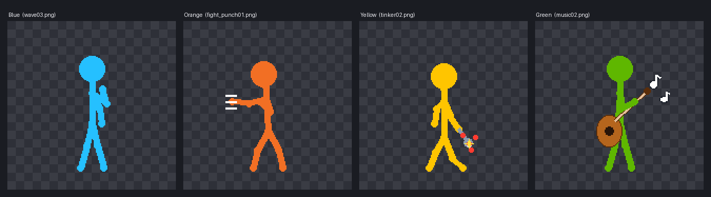
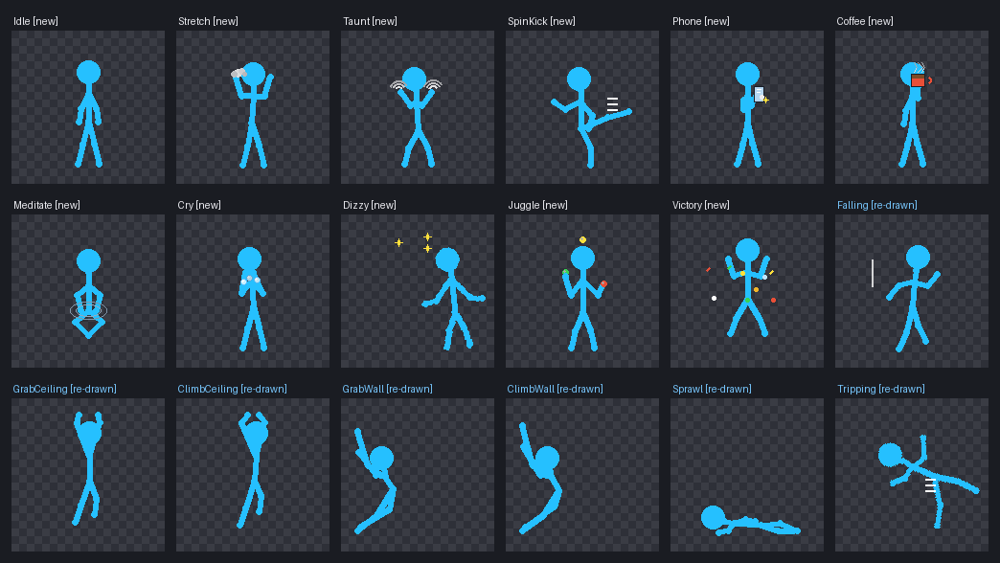
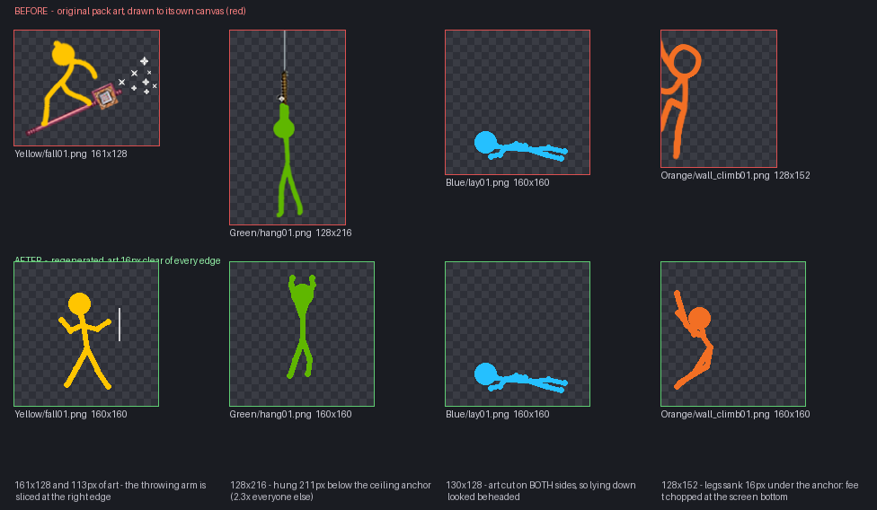

# Stick — AvA Shimeji 4-Pack (Blue / Orange / Yellow / Green)

Animation vs Animator style desktop buddies for **Shimeji-ee on Linux**, with a
batch of crisp animations generated in the pack's exact art style, plus first
class support for **Hyprland**.



Recently rebuilt:

* **18 new moves** and 7 re-drawn pack animations, and the whole personality
  sheet rebalanced so the four stop replaying the same five animations at you
  (see [Animation](#animation)).
* **The frame generator can no longer produce a clipped frame.** Every
  generated frame is 160×160 with 16 px of clear space on every side, verified
  pixel by pixel on every run — so nothing pokes out of its window, ever.
* **No more cloning.** Shimeji-ee's breeding behaviour is switched off in the
  XML, in the installer and in `conf/settings.properties`: the crew stays at
  four.
* **Hyprland script** (`linux/hyprland.sh`) that stops the window boxes and
  makes the shimejis actually start with your session.

---

## If you use Hyprland (or Wayland at all)

Three separate things go wrong on Hyprland, and they need three different fixes:

| What you see | What is actually happening | Fix |
|---|---|---|
| Every shimeji sits in a highlighted box, and they get resized/rearranged | Shimeji-ee draws each character in its own borderless X11 window (`com-group_finity-mascot-Main`). Hyprland **tiles** every new window and paints its border, shadow and blur around it. Hyprland's wiki has a [Shimeji section](https://wiki.hypr.land/Configuring/Uncommon-tips--tricks/#shimeji) for exactly this. | Window rules: `float`, `noborder`, `noshadow`, `noblur`, `nofocus`, `noanim` |
| They come back as a crowd, or the wrong ones come back | Two things: (a) Shimeji-ee's `Breeding` lets every character clone itself while walking, up to 50; (b) `ActiveShimeji=Shimeji` loads whatever image sets happen to be in `img/`. | Breeding off in all three places + `ActiveShimeji=Blue/Orange/Yellow/Green` |
| They never autostart, no matter what you install | **Hyprland does not implement XDG autostart.** It never reads `~/.config/autostart/*.desktop` — that is also why Shijima-Qt never came back after a reboot ([Hyprland #5169](https://github.com/hyprwm/Hyprland/issues/5169), closed as not planned). | Hyprland `exec-once` instead |

```bash
./linux/install.sh          # installs the pack (runs the Hyprland step itself
                            # when it can tell you are on Hyprland)
./linux/hyprland.sh         # or run the Hyprland part on its own
./linux/hyprland.sh --check # show what Hyprland sees, right now
```

`hyprland.sh` detects your config and writes the right flavour of rules:

* `~/.config/hypr/hyprland.conf` — `windowrulev2` (≈0.30–0.52), the unified
  `windowrule ... match :class` form (0.53+, hyprlang), or the legacy
  `windowrule` form on very old builds. Auto-detected from `hyprctl version`,
  overridable with `--syntax v1|v2|v3`.
* `~/.config/hypr/hyprland.lua` — a Lua `hl.window_rule({...})` (0.55+).
* no config found — it prints the snippet to paste.
* Not Hyprland at all — it says so, updates the Shimeji-ee settings and stops.

Everything it writes is idempotent, it backs up any file it edits
(`*.ava-bak`), it leaves other image sets alone, and `--uninstall` puts things
back. It also adds `exec-once = java -jar …/Shimeji-ee.jar` so the crew starts
with your session, and disables the dead `~/.config/autostart` entry (kept for
GNOME/KDE users) so you never get two runners.

### About Shijima-Qt

[Shijima-Qt](https://github.com/pixelomer/Shijima-Qt) is a different app, and it
was [archived/discontinued](https://github.com/pixelomer/Shijima-Qt) in 2026
(Flathub marked it EOL). It also cannot autostart on Hyprland for the same
reason as above. This pack is built for **Shimeji-ee**:

```bash
pkill -f shijima          # don't run two runners at once
~/Shimeji-ee/ava-toggle.sh
```

If you want to try Shijima-Qt anyway, its per-character imports expect the same
`conf/actions.xml` + `conf/behaviors.xml` layout this repo ships, so the folders
in `AVA Shimejis/` are what you would import.

### If you stay on GNOME/Wayland

Java runs through XWayland there, so Shimeji-ee's per-window transparency is not
reliable (black boxes around sprites) and the characters cannot see native
Wayland windows. Log into an X11 session for fully correct behaviour, or force
the window into a dock-style layer with something like
`gdbus call --session … org.gnome.Shell.Eval …` — not worth it; X11 is easier.

---

## Install

```bash
git clone <this-repo> && cd Stick
./linux/install.sh             # auto-finds ~/Shimeji-ee (or pass the path)
./linux/install.sh ~/my-shimeji --replace   # also stash other sets into img/unused
./linux/install.sh --no-hyprland            # skip the Hyprland step
```

What it does:

1. Copies `Blue/ Orange/ Yellow/ Green/` (images + their own `conf/`) into
   Shimeji-ee's `img/` folder.
2. Sets `Breeding=false` and `ActiveShimeji=Blue/Orange/Yellow/Green` in
   `conf/settings.properties` (backup: `settings.properties.ava-bak`).
3. Installs `ava-toggle.sh` next to the jar for on/off control.
4. Installs a `~/.config/autostart/ava-shimeji.desktop` for GNOME/KDE/XFCE.
5. On Hyprland: runs `linux/hyprland.sh` (window rules + `exec-once`).

## On/off toggle

```bash
~/Shimeji-ee/ava-toggle.sh     # stop if running, start if stopped (+ notification)
```

Tip: bind that script to a hotkey — on Hyprland:

```ini
bind = SUPER SHIFT, S, exec, ~/Shimeji-ee/ava-toggle.sh
```

To stop them starting with your session, remove the `exec-once` line from
`~/.config/hypr/ava-shimeji.conf` (Hyprland) or delete
`~/.config/autostart/ava-shimeji.desktop` (GNOME/KDE).

## Want fewer (or more) of them?

The default is exactly one of each. To change the cast, edit
`ActiveShimeji` in `~/Shimeji-ee/conf/settings.properties` (write the folder
names separated by `/`, e.g. `Blue/Green`), or use the app's own menu.

Cloning is disabled in `img/*/conf/behaviors.xml` (`PullUpShimeji`,
`Frequency="0"`) and by `Breeding=false`. Re-enable it by setting
`Breeding=true` and `Frequency="50"` back — but the cap of 50 mascots is why
you were swimming in them.

---

## Animation

266 new frames across the four characters (plus 24 re-drawn ones), all wired
into `conf/actions.xml` and `conf/behaviors.xml` — they happen automatically.



**New in this batch** (all four characters):

| Move | What it looks like |
|---|---|
| Idle | A breath and a weight shift — the difference between a sprite and a statue |
| Stretch | Big arms-up stretch with little puff clouds, then a sigh |
| Taunt | "Come at me" hand curls, then a `!` bubble |
| SpinKick | Wind-up, sweeping kick, landing kick with dust |
| Phone | Phone out of the pocket, thumb scroll (with a `…` bubble), back it goes |
| Coffee | Mug up, steam, sip, satisfied sparkle |
| Meditate | Cross-legged, rings of calm, a few pixels of levitation |
| Cry | Hands to the face with fat tears, sniff, "…" bubble |
| Dizzy | Staggering about the feet with stars over the head, ends with a `?` |
| Juggle | Three-ball cascade, balls passing behind the body |
| Victory | Two fist pumps into a confetti burst |

**Re-drawn pack animations** — these replaced frames that were genuinely
broken. Yellow's fall frames were 161 px wide with the throwing arm sliced off
at the canvas edge; Green's hang frames dangled 211 px below the ceiling (2.3×
everyone else's); Blue's `lay01` was cut on *both* sides; Orange's wall-climb
legs sank up to 19 px under the anchor, so the feet were chopped off at the
bottom of the screen. All of them are regenerated inside their margins:



**Reactive**: CursorSlash still leaps at your cursor when it is within 300 px
(its leap no longer throws the sword off the top of the frame).

### Balancing

Every character gets the same core repertoire, then a personality sheet scales
it — Orange picks fights and pumps his fists more, Blue meditates, sleeps and
drinks coffee, Yellow tinkers and juggles, Green plays guitar and cheers. Four
characters, 37 actions, no two of them behaving alike. The full table is
printed by the validator:

```bash
python3 tools/validate.py
```

It also gates each behaviour by where the character is — ground moves only fire
while standing on the floor or on top of a window, so nobody starts a push-up
mid-air or mimes a guitar while hanging from the ceiling.

### Why the frames are 160×160 now

Poses are authored in the original 128×128 space (centre x=64, feet y=128) and
rendered onto a 160×160 canvas with 16 px of slack on each side, so the art of
a generated frame *cannot* touch the canvas edge. `tools/stickgen.py` asserts
that for every frame it writes, and `tools/validate.py` re-checks it from the
PNGs, so a clipped limb fails the build instead of shipping. Whole-figure
rotations (backflip, spin, trip tumble) are auto-fitted: rotated art is placed
and clamped inside the frame, which is what previously beheaded a backflip.

The original pack's PNGs are kept as they are, at 128×128.

---

## Regenerating / making more

Frames are procedural — tweak poses in `tools/stickgen.py`, then:

```bash
pip install pillow
python3 tools/stickgen.py            # render frames (raises on any clipped frame)
python3 tools/stickgen.py --prune    # ...and delete frames the spec dropped
python3 tools/patch_xml.py           # (re)wire actions.xml + behaviors.xml
python3 tools/validate.py            # frames, XML, references, behaviour balance
```

`tools/ava_common.py` is the single source of truth: which actions exist, how
many frames each has, its anchor canvas, its durations, its behaviour
frequency and where it may fire. The generator, the XML writer and the
validator all read it, so frame counts and XML can no longer drift apart.
A new action is one `_add(...)` entry plus its pose list in `stickgen.py`.

`patch_xml.py` is idempotent by construction (it deletes everything between its
own `<!-- AVA:generated:* -->` markers and writes it back fresh, and it also
cleans up XML left by older versions of the pack). Preview contact sheets and
looping GIFs land in `preview/new/`.

If you ever meet XMLs patched by the very first buggy patcher,
`python3 tools/repair_xml.py` fixes them in place.

## Troubleshooting

| Error / symptom | Cause & fix |
|---|---|
| Shimejis sit in boxes / get tiled / get resized (Hyprland) | Window rules are missing. Run `./linux/hyprland.sh`, then `hyprctl reload`. |
| They never start on login (any Wayland compositor) | XDG autostart is a GNOME/KDE thing. On Hyprland use the `exec-once` that `hyprland.sh` writes; on sway/river/hyprland put `exec java -jar …/Shimeji-ee.jar` in your compositor config. |
| They keep multiplying | Breeding. `PullUpShimeji` must be `Frequency="0"` in each `img/*/conf/behaviors.xml` **and** `Breeding=false` in `conf/settings.properties`. Re-run `tools/patch_xml.py` on a copy of the pack to restore it. |
| Two sets of shimejis, or the wrong ones | `ActiveShimeji` in `conf/settings.properties`; and check nothing else runs one (`pgrep -af 'shijima\|Shimeji-ee'`). |
| They stay asleep / stuck in a pose forever | A behaviour whose action is `Type="Stay"` never ends. The generated ones use `Animate`; if you add your own, don't use `Stay`. |
| Everything renders but `hyprctl clients` shows a huge window | Shimeji-ee sizes its window to the largest frame in the set. That is another reason all generated frames are the same 160×160. |
| `duplicate action found: <name>` | The same action defined twice in `conf/actions.xml`. Fixed here; check a copy with `python3 tools/validate.py`. |
| `no corresponding action <name>` | A `Behavior` whose `Name` matches no action (Shimeji-ee resolves a behaviour's action by the behaviour's own `Name`; an `<ActionReference>` child is not valid inside `<Behavior>`). `python3 tools/repair_xml.py`, then `validate.py`. |
| `NoClassDefFoundError: NimRODTheme` | Shimeji-ee's manifest wants its bundled jars under `lib/`. `install.sh` copies `jna.jar`, `examples.jar`, `AbsoluteLayout.jar`, `nimrodlf.jar` into `lib/` for you. |
| `HeadlessException` on startup | Headless JRE (e.g. Fedora's `java-NN-openjdk-headless`). Install a full JRE: Fedora `sudo dnf install java-<version>-openjdk` (not `-headless`), Debian/Ubuntu `default-jre`. |
| Black boxes instead of sprites (GNOME/Wayland) | Java runs through XWayland there; see the Wayland note above. |

## Layout

```
AVA Shimejis/{Blue,Orange,Yellow,Green}/  image sets + per-character conf/
tools/ava_common.py    the spec: actions, frames, anchors, behaviours (single
                       source of truth for the three tools below)
tools/stickgen.py      frame generator (poses, props, fx) + preview sheets
tools/patch_xml.py     spec-driven, idempotent XML wiring
tools/validate.py      frames, XML, references, behaviour balance report
tools/repair_xml.py    one-time repair for XMLs damaged by the old patcher
linux/install.sh       installer: image sets + toggle + autostart (+ Hyprland)
linux/hyprland.sh      Hyprland: window rules (no boxes) + real autostart
linux/ava-toggle.sh    on/off toggle with desktop notification
docs/                  the images used on this page
```

Made with the generator in this repo — every pixel reproducible. Have fun! 🧡💛💙💚
